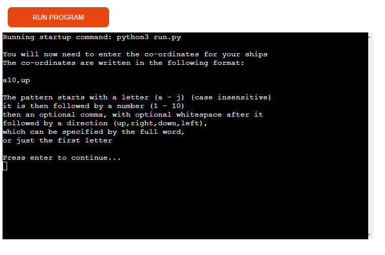
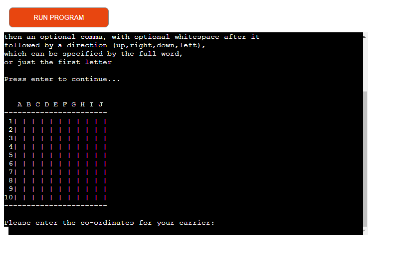
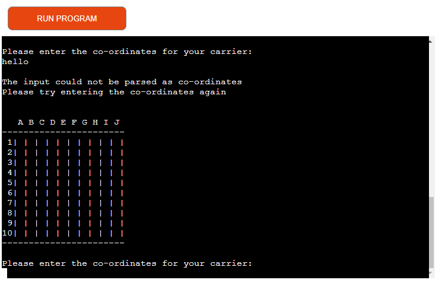
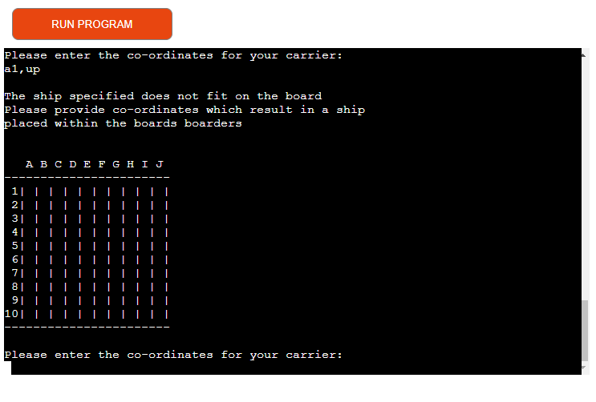
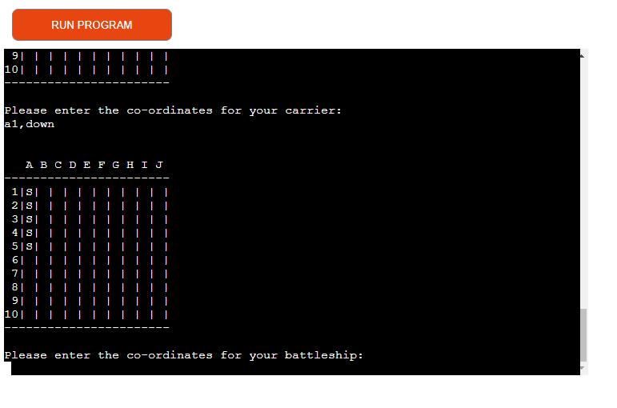
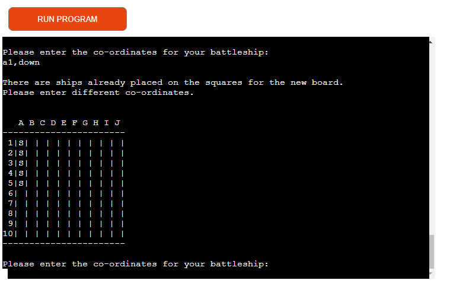

# Battleships

Battleships is a classic boardgame played between two players,
involving each player taking turns to guess the position
of their opponents units.

This is a terminal based implementation of the game.
It is written in Python and runs through Heroku.

## Rules of the game

Battleships is typically played on a 10x10 grid, between two players.

Each player has a set of ships of different sizes available for them to place on this grid.

There are often 5 different classes of ships, with each player having one of each class available to place.
Each class has a distinct size, with each ship only able to be placed on the grid vertically or horizontally.

Each square on the grid can either be empty or occupied, and if occupied, can only be occupied by one ship.

For this game we will be using the following classes with the corresponding sizes:
| Ship Class | Size |
|------------|------|
| Carrier    |   5  |
| Battleship |   4  |
| Cruiser    |   3  |
| Submarine  |   3  |
| Destroyer  |   2  |

At the beginning of a game, each player places all of their ships in secret; each player is unable to view the positions of their opponent's ships.

Once all the ships have been placed, each player takes turns choosing squares on the grid.
When a player chooses a square they provide the coordinates for that square.
If there was a ship on the square chosen, the ship is hit.

If a player can hit all the squares of a ship, that ship is sunk.

If all of a player's ships are sunk, that player loses.

## Design

### Features

#### Initial instructions

When starting the app, the user is provided with instructions explaining that the app will prompt for input of the user's ships.
The app provides the user with an explanation and example of the input accepted as valid co-ordinates for their ships.

The intended value of this is to make it clear to the user of what they are expected to do at the beginning of the program, and by explaining how much leeway they are allowed with their choice of input.

#### First prompt for ships co-ordinates

After the user presses enter to pass the initial instructions provided to them, they are asked to enter the co-ordinates for their carrier.

Above the prompt where they can enter their chosen position and orientation of this unit, the game board is drawn.
At this stage the board is empty. However, this still provides a benefit to the user by assisting with visualising the play field for their units.

#### Entry of input unparseable as co-ordinates

If the user enters a string which the program fails to parse as valid co-ordinate and orientation data for their ships, they are provided with an error/warning informing them that the string did not match the pattern expected for this input request.

#### Entry of a unit's position which doesn't fit on the game board

If the user enters a string which is parseable as co-ordinates and an orientation for the given unit which the program is requesting input for, however, the resulting position would be invalid (i.e. a ship which is off of the game board), then the program prints an error informing the user of this fact.

#### Valid entry of a unit's co-ordinates and orientation

Once the user enters a valid co-ordinate and orientation for their unit, they are then shown the game board with the resulting unit drawn in the correct position.

If they still have units which they need to specify the position of, they will then be asked for input for the next unit. The game board will be redrawn for each unit which is given a valid position.

#### Entry of unit positions which overlap with previously defined units

In the case that the user enters an input for a unit's position which would result in the unit overlapping with a previously defined unit, they are provided with an error message informing them of this.

The intended benefit of this is to handle an error case and make it clear to the user what went wrong, rather than silently discarding their input, or corrupting the program state with an invalid board state.

## Testing

### PEP8 Validator

I passed my code into the [Code Institute PEP8 Validator](https://pep8ci.herokuapp.com/).
My code passed without any errors.

## Credits

### Python

This project makes use of Python.
Python software and documentation is licensed under the [PSF License Agreement](https://docs.python.org/3/license.html#psf-license)

### Python Libraries

#### Re

This app makes use of the regular expression library from the CPython standard library.
This library is under copyright of 'Secret Labs AB' and is distributed under the [CNRI's Python 1.6 license](https://docs.python.org/3/license.html#cnri-license-agreement-for-python-1-6-1)

I used the documentation available [here](https://docs.python.org/3/library/re.html#module-re) to assist me with writing the code for the `PlayerGameBoard.__check_input` method.

### Code Institute

This project makes use of the Code Institute's Gitpod template.
This template is available [here](https://github.com/Code-Institute-Org/python-essentials-template)

## Deployment

This application was deployed on Heroku

The steps for the deployment were as follows:
1. Sign up for Heroku
2. Create a new app from the dashboard
3. Fill in the inital details of the app - name, region
4. Move to the settings of the app and add a config variable key and value pair of: `PORT=8000`
5. From the settings page, add `heroku/python` and `heroku/nodejs` to the list of buildpacks; making sure that they are kept in that order
6. Move to the deployment page of the heroku app's settings, connect the app to my GitHub account and connect it to this repository
7. Make sure that the deployment is based on the `main` branch of the repository and manually deploy the app
8. Make sure that the application was deployed successfully and check and test the application performs as expected

I have chosen to keep the deployment manual
